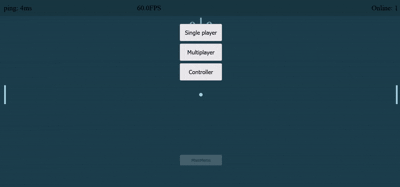

# Pong

## What's a Pong?

Pong is a two-player, 2D sports game that simulates table tennis. Players control paddles to hit a ball back and forth across a screen, with the goal of scoring points by having the ball pass the opponent's paddle

### Features

- Player vs Computer
- Player vs Player (PvP)

### Demo

